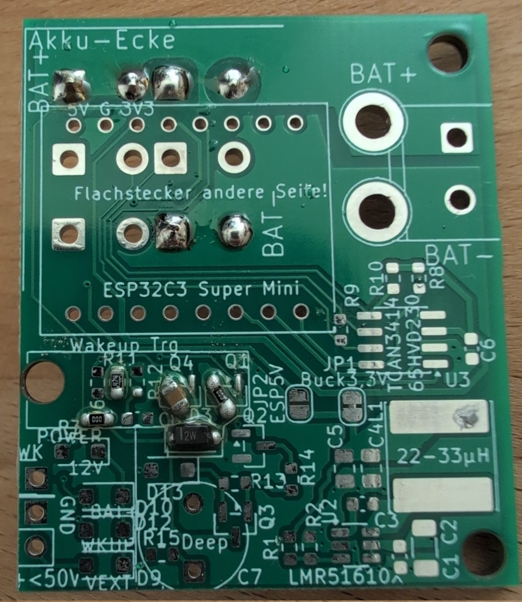
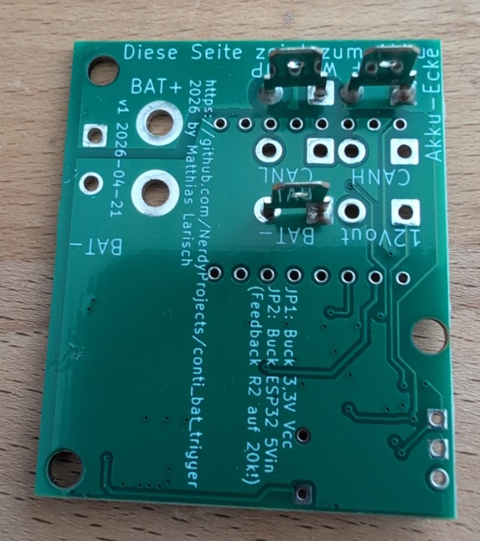
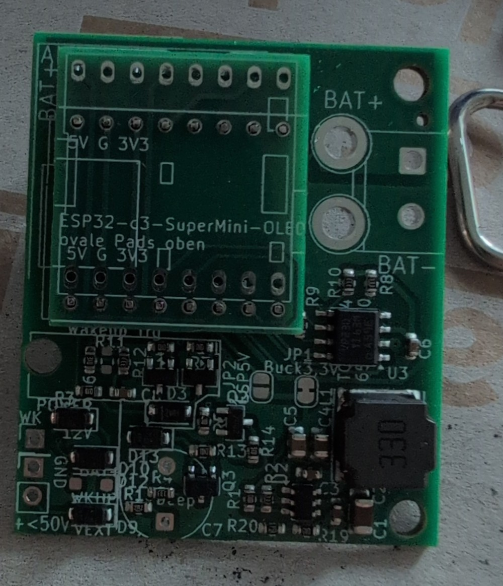
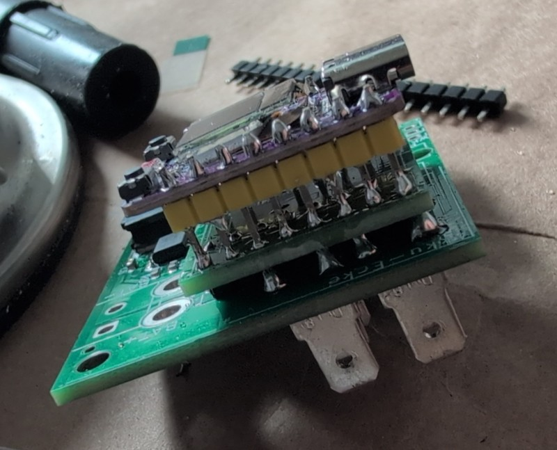
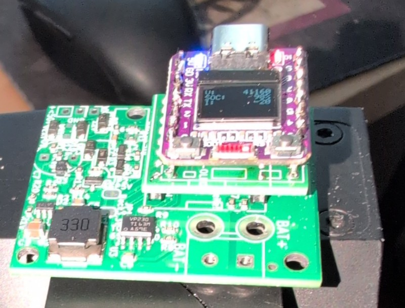
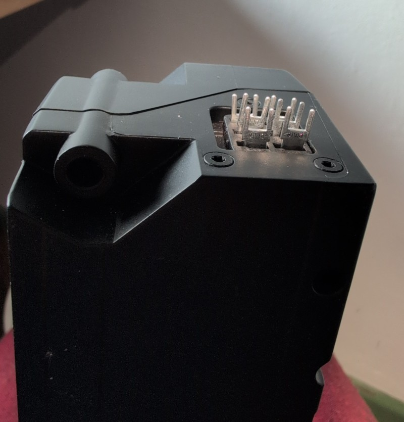
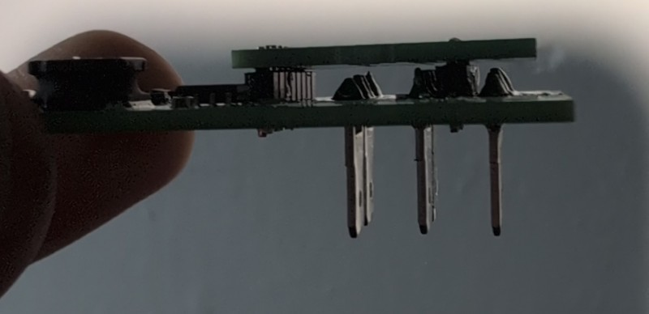

## Contiakku Triggerplatine

Die Conti-Akkus aus dem Finger-Forum liegen immer noch rum, eine Platine muss her, damit es einfach wird.

[Foren Thread: Conti-Akku, Technikfaden](https://www.fingers-welt.de/phpBB/viewtopic.php?t=19876)

**Status: Untested**

### Funktionalität
* 4,8mm Flachstecker auf der Platine, die direkt auf den Akkustecker passen (zusätzliches Gehäuse empfehlenswert, da ohne kein Verpolschutz!)
* ESP32-C3 Supermini als Basis: Billig, einfach, mit CAN, USB, Wlan.
* Versorgung vom Akkupack oder Charger
* Trigger des Wakeups auf 12V oder 0V
* Trigger des Wakeups auf 12V für Akkus im Deepsleep, wenn Ladegerät angeschlossen
* Wachhalten per CAN

### Timeline
* Mitte Mai: PCB Bestellung
* Bis Ende Mai: Erste Tests geplant

## Errata
### HW v1 (Prod. 2026-05-06)
 * Fehlender Widerstand am Wakeup-Pullup. Wenn Pullup und Pulldown gleichzeitig aktiviert werden würden, kommt es zum Kurzschluss. Abhilfe: Leiterbahn zwischen D13 und R13 durchtrennen, einen Widerstand 1-5k darüber löten. Der passt gut auf die Pads mit drauf. Alternativ den Trace zwischen R15 und D13 (der von Q3 zu D3 geht) durchtrennen, etwas Lötstopp wegkratzen und dort die 1-3k einlöten.
 * Spannungsregler ist immer an - der Conti-Akku gibt auch im Aus-Zustand etwas Spannung am Batterie-Pin aus. Das reicht um die Platine "halb" zu starten - der ESP hat keinen Strom, aber die LED leuchtet. Führt zu höherem Ruhestrom bei gesteckter Platine.

 ### HW v2 (Prod. 2025-05-29)
 * Spannungsregler Enable ist auf etwa 7,5V Einschaltschwelle konfiguriert, allerdings gibt der Akku eine Leerlaufspannung von knapp 16V aus im abgeschalteten Zustand. Leider startet der Spannungsregler dann immernoch, die Platine braucht wenige mA Strom. Damit die Platine sowohl Lade-Wakeup (Versorgung per BAT+) und Entladewakeup (Versorgung über 12Vout) kann, gibt es hier leider keine sinnvolle Einschaltschwelle, ich habe keine Lösung für das Problem.

 ### Aufbau
 #### Charge Only
 * Nur als Ladewachhalter, lädt ?max. 8 Stunden oder bis Akku voll; jedenfalls länger als 1 Stunde?.
 * Achtung: Der Akku stoppt den Ladevorgang scheinbar nicht selbstständig! Überladegefahr!
 
 

 

 Von links nach rechts:
 * R3: 0 Ohm - 1 kOhm
 * R11: 470 kOhm zum Entladen vom Wakeup-Kurzschluss-Trigger-Kondensator
 * Q4 diagonal: 1-10µF Wakeup-Kurzschluss-Trigger-Kondensator
 * D3: 12V Zenerdiode, Strich nach links (Durchlassrichtung rechts nach links)
 * Q1: Brücke von Pin 2 nach 3

 #### ESP Bestückung

 Ganz wichtig: Reihenfolge beachten, sonst kommt man nicht mehr an die Pads dran.

 1. Stiftleisten auf Platine löten - ggf. zum richtigen Abstand halten den ESP bzw. die Adapterplatine schon oben auflegen
 2. Flachstecker bestücken (siehe unten)
 3. Sofern der Display-Adapter zum Einsatz kommt, nun die oberen Stiftleisten hier anlöten - ovale Pads. Achtung: Die obere Reihe kollidiert sehr schnell mit den Flachsteckern, kurze Seite der Stiftleiste nach unten bzw. nachkürzen!
 4. Display Adapter auf Platine löten, dabei nochmal genau mit allen Abständen schauen, ggf. etwas hoch stehen lassen, wenn Flachstecker zu weit hochschauen.
 5. ESP auf Displayadapter bzw. Platine löten - genau darauf achten, dass unterhalb kein Kurzschluss entsteht - ggf. etwas mehr Abstand lassen.

 

So sieht das aus, wenn man in der falschen Reihenfolge lötet. Mit etwas mehr Abstand noch rettbar :-)

 

Und fertig, mit Oled und der ersten Software:

 

 #### Flachstecker-Bestückung

 

 * Flachstecker am besten in einen Conti-Akku stecken. Soweit bekannt, passiert hier bei Kurzschlüssen nichts.

 

 * Beim Anlöten der Platine darauf achten, die Flachstecker nicht ganz durchzustecken, alternativ muss später oben Abstand gehalten werden. Sprich: Insgesamt darauf achten, dass die Flachstecker am Ende keinen Kurzschluss mit der Platine darüber machen.

